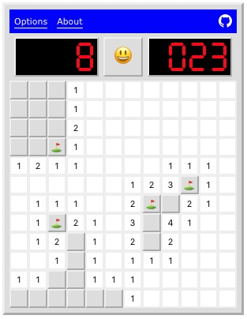

# react-minesweeper



Minesweeper in Typescript + React. Includes four different difficulty levels and calculates score according to [3BV](http://www.stephan-bechtel.de/3bv.htm).

[**Demo**](https://msimmer.github.io/react-minesweeper/)

## Install

```
$ git clone https://github.com/msimmer/react-minesweeper.git
$ cd react-minesweeper && yarn
```

## Run

```
$ yarn start
```

## Test

```
$ yarn test
```

## Build

```
$ yarn build
```
